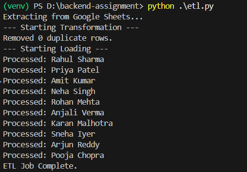
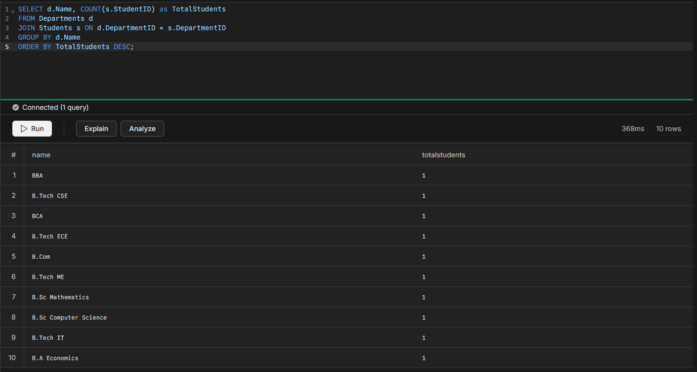
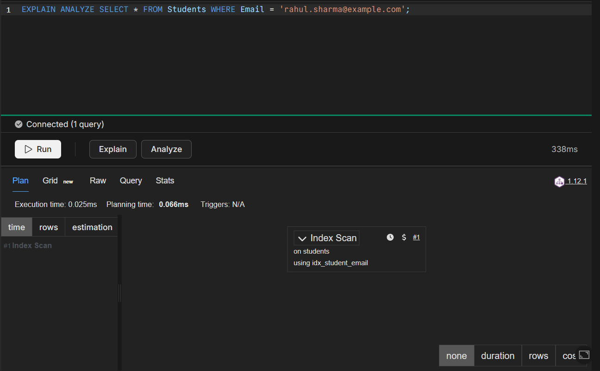
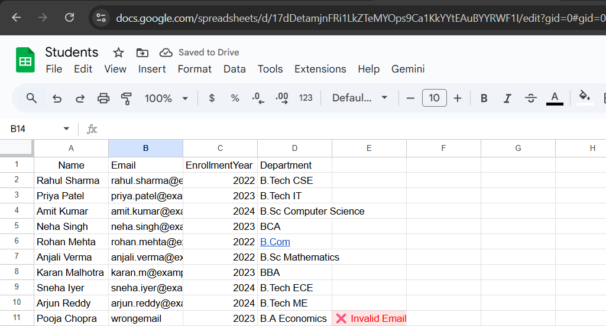

# Student Data Migration Project (Google Sheets → NeonDB)

## Overview
This project is a fully automated ETL pipeline that migrates student data from Google Sheets to a normalized PostgreSQL database hosted on NeonDB.

## 🛠 Tech Stack
- **Source:** Google Sheets API
- **Destination:** NeonDB (PostgreSQL)
- **Language:** Python (Pandas, SQLAlchemy)
- **Automation:** Google Apps Script

## Database Schema
The database is normalized to 3NF.
- **Students** (Linked to Departments)
- **Departments** (Unique List)
- **Courses & Enrollments** (Many-to-Many relationship)

## ETL Execution
The Python script extracts data, removes duplicates, validates emails, and loads it into NeonDB. 

## SQL Analysis & Optimization
**Total Students per Department:**

**Query Optimization:**
Used `EXPLAIN ANALYZE` to verify index usage on Email lookups.

## Automation 
Google Sheets automatically validates data entry using Apps Script before ingestion.
